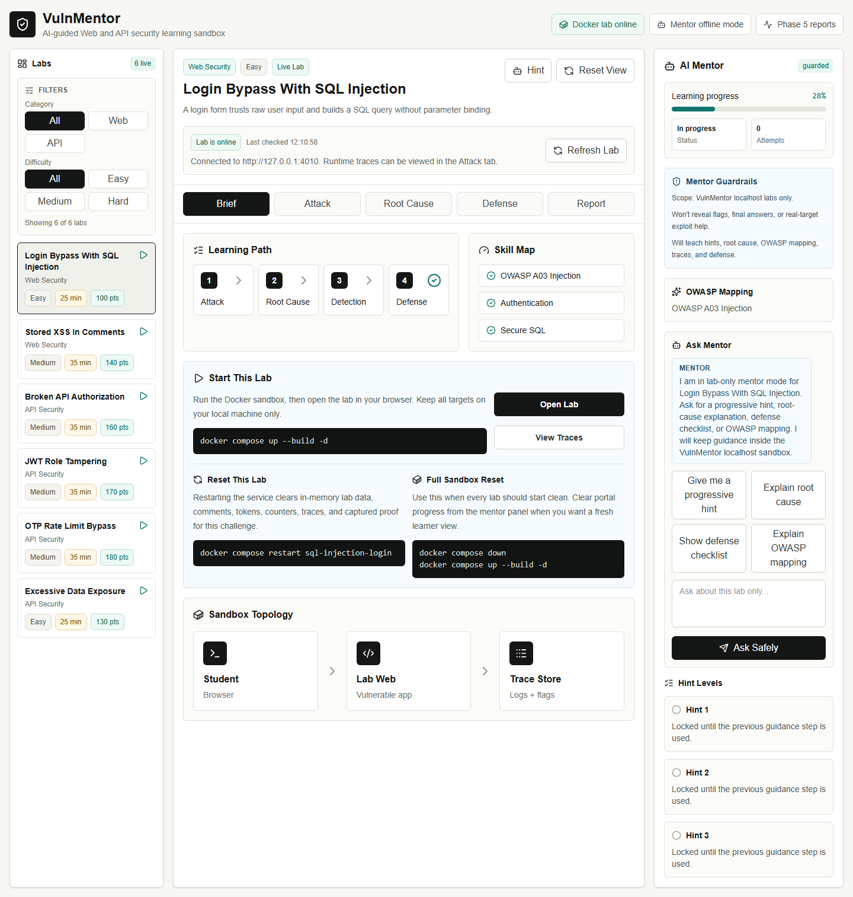
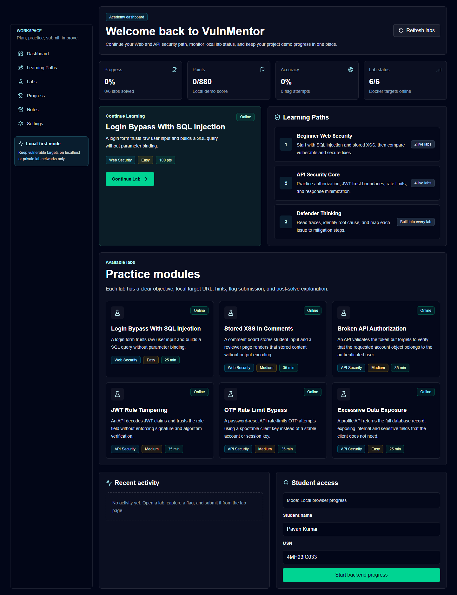

# VulnMentor

VulnMentor is an AI-guided Web and API security CTF sandbox for students. The goal is to help learners practice vulnerabilities safely, capture flags, understand root causes, compare vulnerable and secure code, and learn defensive thinking through logs and mitigation notes.

This repository is intentionally educational. Labs must run only in the controlled local sandbox.

## Project Highlights

- Web + API security labs mapped to OWASP concepts
- CTF-style flag workflow with local progress tracking
- Vulnerable and secure comparison views
- Dockerized localhost lab targets
- Guarded offline AI Mentor for safe learning guidance
- Admin-style progress report with JSON/CSV export
- Public-safe documentation for college demos and portfolio review

## Screenshots





## Current Build

- Next.js learning portal
- Docker-based SQL Injection login lab
- Docker-based Stored XSS comment lab
- Docker-based API Broken Authorization / IDOR lab
- Docker-based API JWT tampering lab
- Docker-based API Rate Limit Bypass lab
- Docker-based API Excessive Data Exposure lab
- Lab health check from the portal
- Runtime trace view from the lab
- Challenge filtering by category and difficulty
- Per-lab Docker reset instructions
- Flag submission workflow
- Local progress and attempt history
- Progressive hints
- Offline AI Mentor with lab-only guardrails
- Safe refusal behavior for real-world target requests
- OWASP mapping and post-solve debrief guidance
- Demo student login with HTTP-only session cookie
- Backend-backed progress using local JSON database storage
- Admin-style report tab
- Student progress report and attempt logs dashboard
- Exportable JSON/CSV demo data
- Challenge authoring format reference
- Root-cause explanation
- Vulnerable vs secure code comparison
- Mitigation checklist

## Architecture

```text
Learner Browser
    |
    | http://localhost:3000
    v
VulnMentor Portal
    |
    | checks health/traces
    v
Docker Labs on 127.0.0.1:4010 through 127.0.0.1:4060
```

For now, both the portal and the lab are designed to run locally on the learner's laptop. Later, the portal can be hosted, but the vulnerable labs should still run locally or inside a controlled cyber range/VM.

## Run The Portal

```bash
npm install
npm run dev
```

Open:

```text
http://localhost:3000
http://localhost:3000/dashboard
http://localhost:3000/labs/web-sqli-login
```

The stable pre-redesign version is marked in Git as `backup-before-academy-ui-bfbe0f5`.

Backend progress is stored locally in:

```text
.data/vulnmentor-progress.json
```

The `.data` folder is ignored by Git because it contains local demo student sessions and attempt history.

## Run The Labs

Install Docker Desktop, then run:

```bash
docker compose up --build -d
```

Open the labs directly:

```text
http://127.0.0.1:4010
http://127.0.0.1:4020
http://127.0.0.1:4030
http://127.0.0.1:4040
http://127.0.0.1:4050
http://127.0.0.1:4060
```

Reset one lab when you want a clean challenge state:

```bash
docker compose restart stored-xss-comment
```

Reset the full sandbox:

```bash
docker compose down
docker compose up --build -d
```

Health endpoints:

```text
http://127.0.0.1:4010/health
http://127.0.0.1:4020/health
http://127.0.0.1:4030/health
http://127.0.0.1:4040/health
http://127.0.0.1:4050/health
http://127.0.0.1:4060/health
```

Trace endpoints:

```text
http://127.0.0.1:4010/traces
http://127.0.0.1:4020/traces
http://127.0.0.1:4030/traces
http://127.0.0.1:4040/traces
http://127.0.0.1:4050/traces
http://127.0.0.1:4060/traces
```

## Flag Policy

Flags are intentionally not listed in the README. Learners should solve each local lab and submit captured flags through the VulnMentor portal. This keeps the public project page useful for guides and recruiters without turning it into an answer sheet.

## Safe Usage Rules

- Attack only the labs in this repository.
- Do not test payloads against real websites or third-party APIs.
- Do not deploy vulnerable labs publicly without network restrictions.
- Keep flags, secrets, and API keys out of the frontend.
- Use this project for learning, college demonstration, and controlled practice.

More details: [SAFETY.md](./SAFETY.md)

## Project Roadmap

The build plan is tracked in [ROADMAP.md](./ROADMAP.md).

## Documentation

- [Safety and ethics](./SAFETY.md)
- [Run locally](./docs/RUN_LOCALLY.md)
- [Deployment model](./docs/DEPLOYMENT_MODEL.md)
- [Architecture](./docs/ARCHITECTURE.md)
- [Demo script](./docs/DEMO_SCRIPT.md)
- [Portfolio showcase notes](./docs/PORTFOLIO_SHOWCASE.md)
- [Final presentation checklist](./docs/FINAL_PRESENTATION_CHECKLIST.md)
- [Screenshots](./docs/SCREENSHOTS.md)
- [Testing guide](./docs/TESTING_GUIDE.md)
- [Roadmap](./ROADMAP.md)

## Scripts

```bash
npm run lint
npm run build
npm run screenshots
```

## Tech Stack

- Frontend: Next.js, React, TypeScript
- UI: Tailwind CSS, lucide-react icons
- Labs: Docker Compose
- Lab runtimes: Python HTTP servers, SQLite for SQLi lab, in-memory records for Web/API labs

Planned additions:

- Backend persistence for users and progress
- More secure comparison coverage
- Optional hosted LLM backend for the guarded mentor workflow
- Backend-backed admin dashboard
- Multi-student reporting
- Final demo and deployment guide
