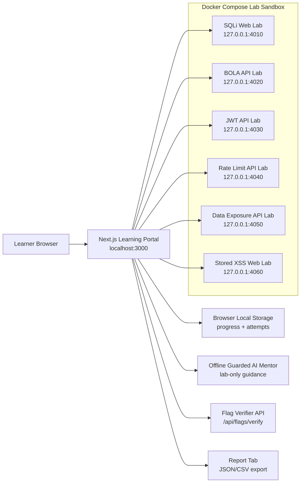

# VulnMentor Architecture

VulnMentor is designed as a local-first cybersecurity learning platform. The safe portal and intentionally vulnerable labs are separated so students can learn offensive and defensive concepts without exposing unsafe services to the public internet.

## System Overview



## Component Responsibilities

| Component | Responsibility |
| --- | --- |
| Next.js Portal | Lab navigation, hints, attack traces, flag submission, mentor panel, reports |
| Docker Labs | Isolated vulnerable and secure comparison targets |
| Flag Verifier | Checks captured flags server-side through the portal API |
| Local Storage | Prototype progress store for solved labs and attempt history |
| Offline AI Mentor | Rule-based guided learning with safety guardrails |
| Report Tab | Student progress summary, attempt logs, and demo data export |

## Lab Communication

Each lab exposes:

- `GET /health` for portal health checks
- `GET /traces` for runtime trace viewing
- Vulnerable endpoints or pages for challenge solving
- Secure comparison endpoints or pages where applicable

The portal polls health and traces from the selected lab. This keeps the learner experience realistic while staying simple enough for a college project demo.

## Safety Boundary

Vulnerable services must stay local or inside a controlled private environment.

```text
Safe to host publicly:
- README and documentation
- Static screenshots
- Safe frontend-only demo pages

Not safe to host publicly:
- Intentionally vulnerable Docker labs
- Lab flags as public answer material
- Any endpoint designed to demonstrate broken security
```

## Future Architecture

The current build is intentionally local-first. A later production-style version can add:

- Authentication
- Database-backed progress
- Multi-student class mode
- Instructor guide console
- Hosted safe portal
- Private cyber range or VM-backed lab execution
